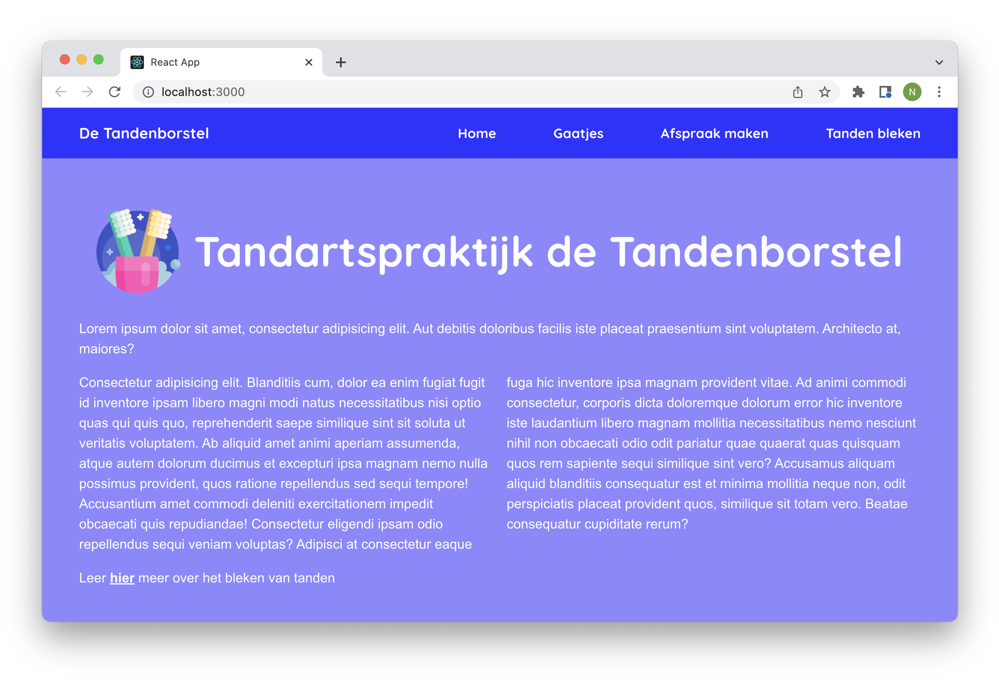

# Opdrachtbeschrijving

## Inleiding

Je gaat zelf routing implementeren voor de website van Tandartspraktijk de Tandenborstel. Dit ga je doen door gebruik te maken van de package React Router.

## Applicatie starten

Als je het project gecloned hebt naar jouw locale machine, installeer je eerst de `node_modules` door het volgende
commando in de terminal te runnen

`npm install`

Wanneer dit klaar is, kun je de applicatie starten met behulp van:

`npm run dev`

... of gebruik de WebStorm knop (npm run dev). Open http://localhost:5173 om de pagina in de browser te bekijken. Begin met
het maken van wijzigingen in `src/App.jsx`: elke keer als je een bestand opslaat, zullen de wijzigingen te zien zijn op
de webpagina.

## Opdrachtbeschrijving
Onderstaande stappen beschrijven op globale wijze wat er moet gebeuren. Schroom niet om in EdHub te spieken naar syntax:

1. Installeer React Router Dom in het project;
2. Wikkel het buitenste React Router element om de applicatie in `main.jsx`;
3. Implementeer routing voor alle vier de pagina's in `App.jsx`:
    - De homepagina op `/`
    - De appointmentspagina op `/afspraken`
    - De cavitiespagina op `/gaatjes`
    - De whiteningpagina op `/tanden-bleken`
4. Check vervolgens of dit werkt door in de adresbalk de url aan te passen. Veranderen de pagina's?
5. Op de homepagina en appointmentspagina staat onderaan een paragraaf met het zinnetje: _'Leer hier meer over [onderwerp]'_. Zorg ervoor dat het woord 'hier' klikbaar wordt en de gebruiker doorstuurt naar de juiste pagina.
6. Zorg ervoor dat de menu-items in `Navigation.jsx` klikbaar worden en de gebruiker doorsturen naar de juiste pagina;
7. Zorg ervoor dat het actieve menu-item wit onderstreept wordt, door twee CSS classes te maken in het bijbehorende `Navigation.css` document en deze op de juiste manier door te geven aan het `NavLink`-component van React Router.
8. Maak ten slotte de button op de cavitiespagina functioneel, door de volgende acties te ondernemen:
   - Maak een eigen, externe `clickHandler`-functie;
   - Zorg ervoor dat deze functie wordt aangeroepen wanneer er op de button geklikt wordt;
   - Zorg ervoor dat wanneer deze functie wordt aangeroepen, er "We gaan direct door naar de afspraken pagina!" wordt gelogd in de console;
   - Stuur de gebruiker daarna door naar de appointmentspagina;
